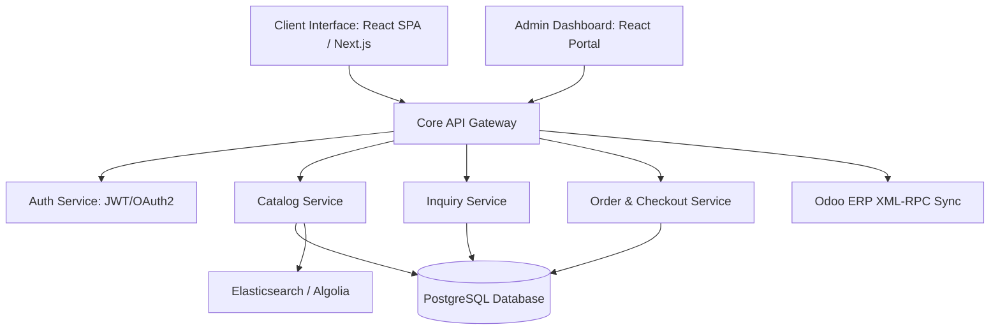
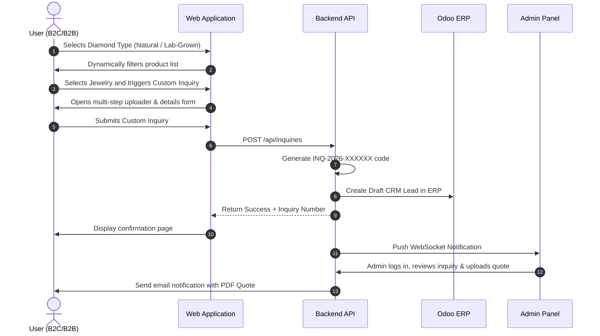

# System Architecture, Security & Development Plan

This document details the architectural layout, security frameworks, testing strategy, and execution roadmap for the Diamond & Jewelry Platform.

---

## 1. Information Architecture
The platform is organized into three main modules: the B2C/B2B Client Interface, the RESTful Core API Gateway, and the Admin Control Panel.

---

## 2. User Journey Flow (Custom Inquiry & Purchase)
This diagram illustrates the user journey for choosing diamonds, customizing, and checking out or submitting inquiries.

---

## 3. Security Architecture
To satisfy the enterprise-grade security requirement, the platform incorporates:
*   **Transport Layer Security (TLS/SSL)**: Forced HTTPS with HSTS headers. All payload data in transit is encrypted using TLS 1.3.
*   **Authentication & Session Management**: Stateless JWT (JSON Web Tokens) with a short lifespan (15 mins) and HTTP-Only, Secure, SameSite-strict cookies for refresh tokens.
*   **Role-Based Access Control (RBAC)**: Fine-grained permissions mapping to roles:
    *   *Super Admin*: Full access including system logs and payment configurations.
    *   *Inventory Manager*: Access to product catalogs, layouts, melee diamonds, and warehouse allocations.
    *   *Customer Support*: Access to inquiries, user communication, and wishlist data.
*   **OWASP Top 10 Protections**:
    *   *SQL Injection*: Prepared statements and parameterization in PostgreSQL.
    *   *Cross-Site Scripting (XSS)*: Input sanitization, output HTML entity encoding, and a strict Content Security Policy (CSP).
    *   *Cross-Site Request Forgery (CSRF)*: Anti-CSRF double-submit tokens for state-modifying POST/PUT/DELETE requests.
    *   *Rate Limiting*: Express-rate-limit configured at 100 requests per 15 minutes per IP address (excluding assets).

---

## 4. Testing Strategy
*   **Unit Testing**: Jest & React Testing Library (Frontend); Mocha/Chai or PyTest (Backend). Goal: >85% code coverage.
*   **Integration Testing**: Verify API route responses, database connection states, and external payment webhooks.
*   **User Acceptance Testing (UAT)**: Multi-device manual testing (Safari iOS, Chrome Android, Desktop macOS/Windows) via BrowserStack.
*   **Load & Performance Testing**: Artillery or k6 running scenarios simulating 5,000 concurrent shopping carts.

---

## 5. Deployment Plan
*   **Containerization**: Docker multi-stage builds.
*   **Orchestration**: AWS Elastic Container Service (ECS) with AWS Fargate serverless deployment.
*   **CI/CD Pipeline**: GitHub Actions auto-triggering on merge to `main`. Runs linter, unit tests, builds image, pushes to Amazon ECR, and triggers ECS service update.

---

## 6. Development Timeline & Resource Allocation
Estimated project timeline: **18 Weeks**

| Phase | Duration | Scope | Key Deliverables |
| :--- | :--- | :--- | :--- |
| **Phase 1: Design** | Weeks 1-3 | Database structure, wireframes, style guide | Database schema, Figma models |
| **Phase 2: Core Dev** | Weeks 4-9 | API structures, Catalog filter system, context | RESTful APIs, filtering logic |
| **Phase 3: Features**| Weeks 10-14 | Checkout integration, admin panels, Custom Inquiry | Payment gates, custom uploader |
| **Phase 4: Testing** | Weeks 15-16 | QA, security vulnerability scans, performance | Security scan report, UAT logs |
| **Phase 5: Release** | Weeks 17-18 | Deployment, ERP data sync, SEO validation | Live platform, Odoo sync integration |

### Team Structure
*   1x UI/UX Designer
*   1x Solution Architect / Lead Developer
*   2x Frontend Developers (React)
*   1x Backend Developer (APIs, Database)
*   1x QA & DevOps Engineer
*   1x Project Manager
