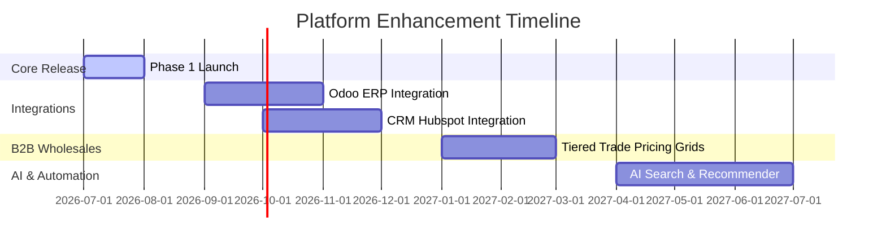

# Project Cost Estimation & Future Roadmap

This document outlines the software engineering and cloud resource cost structures, alongside a modular enhancement roadmap for future phases.

---

## 1. Project Cost Estimation

### A. Team Labor & Development Costs (18 Weeks)
Below is the estimated budgetary allocation for the development team based on the proposed 18-week schedule.

| Resource Role | Allocation Rate (Est. Monthly) | Duration | Cost Estimate |
| :--- | :--- | :--- | :--- |
| **Solution Architect / Lead Dev** | $12,000 / month | 4.5 Months | $54,000 |
| **Frontend Developers (x2)** | $16,000 / month (total) | 4.5 Months | $72,000 |
| **Backend Developer (x1)** | $8,500 / month | 4.5 Months | $38,250 |
| **DevOps & QA Engineer (x1)**| $8,000 / month | 3.5 Months | $28,000 |
| **UI/UX Designer (x1)** | $7,500 / month | 2 Months | $15,000 |
| **Project Manager (x1)** | $7,000 / month | 4.5 Months | $31,500 |
| **Total Labor Budget** | | | **$238,750** |

---

### B. Monthly Cloud Infrastructure & Third-Party SaaS Estimates
Infrastructure operational costs scale dynamically with client traffic:

| Item | Service Provider | Monthly Cost (Est.) | Purpose |
| :--- | :--- | :--- | :--- |
| **Container Hosting** | AWS (ECS Fargate + ELB) | $350 / month | High availability backend hosting |
| **Managed Database** | AWS RDS (PostgreSQL) | $200 / month | Encrypted multi-AZ transactions |
| **Advanced Search API** | Algolia / Elasticsearch | $150 / month | Millisecond-level faceted navigation |
| **Transactional Mail** | SendGrid | $35 / month | Automated invoice & inquiry emails |
| **Asset CDN** | AWS CloudFront / S3 | $120 / month | Global high-res diamond media caching |
| **Security WAF** | Cloudflare Enterprise | $200 / month | DDoS protection, rate limiting, SSL |
| **Total Infrastructure** | | **$1,055 / month** | |

---

## 2. Future Enhancement Roadmap

Following the Phase 1 release, the platform is architected to scale into the following strategic capabilities:

### Phase 2: Odoo ERP & CRM Sync (Months 2–4 Post-Launch)
*   **Odoo Inventory Sync**: Automated update of carat sizes, weights, and loose diamond counts from Odoo’s Inventory App into the Postgres DB using JSON webhooks.
*   **Customer Sync**: Synchronize B2B customer accounts, credit limits, and invoice histories with Odoo Accounting.
*   **CRM Lead Routing**: Automatically forward all custom inquiries (`INQ-` records) into Odoo CRM pipelines as sales opportunities.

### Phase 3: B2B Wholesale & Customer Tier Pricing (Months 6–9 Post-Launch)
*   **Tiered Pricing**: Grant wholesale partners customized discounts based on tier levels (Silver, Gold, Platinum).
*   **Credit/Term Payments**: Allow trusted B2B accounts to checkout using "Net 30/60" terms, bypassed by invoice verification.

### Phase 4: AI Search & Recommendations (Months 10–12 Post-Launch)
*   **Vector Search**: Implement semantic AI search so clients can search with natural phrases like "gold ring with matching side stones and high clarity."
*   **AI Recommender**: Match jewelry selections with optimal melee loose diamonds automatically.
